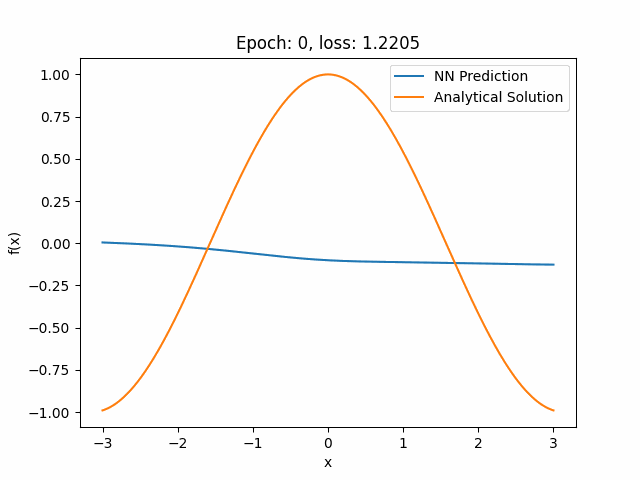

# Physics-Informed Neural Networks (PINNs)

## **Project Goal**

The goal of this project is to develop a framework using a deep learning model to approximate solutions to Partial Differential Equations (PDEs) without requiring any input data. The Physics-Informed Neural Network (PINN) is trained solely on:

- **Physics Loss**: Derived from the governing equations (e.g., PDE = 0).
- 
- **Boundary Conditions (BC) Loss**: Ensuring the solution satisfies the boundary constraints.

## **Objectives**

The project progresses through increasingly complex problems:

1. **Simple ODEs**:white_check_mark:: 
   - PINN: $f_{\theta}: \mathbb{R} \rightarrow \mathbb{R}$
   - ODE to approximate: $f' = f, f(0) = 1$
   - Physics Loss: $\lVert f_{\theta}' - f_{\theta}\rVert$
   - Boundary Loss: $\lVert f_{\theta}(0) - 1 \rVert$
   - Analytical solution: $\exp: \mathbb{R} \rightarrow \mathbb{R}$

   

2. **Higher-Order ODEs** :white_check_mark::
   - PINN: $f_{\theta}: \mathbb{R} \rightarrow \mathbb{R}$
   - ODE to approximate: $f'' = f, f(0) = 1, f'(0) = 0$
   - Physics Loss: $\lVert f_{\theta}'' - f_{\theta} \rVert$
   - Boundary Loss: $\lVert f_{\theta}(0) - 1 \rVert, \lVert f'_{\theta}(0) \rVert$
   - Analytical solution: $\cos: \mathbb{R} \rightarrow \mathbb{R}$

   

1. **Laplace Equation** :x::
   - PINN: $f_{\theta}: [0, 1]^2 \rightarrow \mathbb{R}$
   - PDE to approximate: $\Delta f = 0$
   - Dirichlet boundary conditions: $f(\cdot, 0) = 0, f(\cdot, 1) = \sin(\pi x), f(0, \cdot) = 0, f(1, \cdot) = 0$
   - Physics loss: $\lVert \Delta f_{\theta} \rVert$
   - Boundary loss: $\lVert f_{\theta}(\cdot, 0) \rVert, \lVert f_{\theta}(\cdot, 1) - \sin(\pi x) \rVert, \lVert f_{\theta}(0, \cdot) \rVert, \lVert f_{\theta}(1, \cdot) \rVert$
   - Analytical solution: $f(x, y) = \sin(\pi x) \sinh(\pi y)/\sinh(\pi)$

2. **Navier-Stokes Equations** :x::
   - Solve fluid dynamics problems governed by the Navier-Stokes equations.

### **Installation**

Ensure you have the following installed on your system:

- ✔️ Python 3.8+
- ✔️ PyTorch (with MPS support for macOS)  
- ✔️ Additional Python dependencies

1. **Clone the Repository**:

   Clone this repository to your local machine:
   ```bash
   git clone https://github.com/LeonDeligny/LearnPDEs.git
   cd LearnPDEs

2. **Install dependencies**: 

   Install the dependencies with:
   ```bash
   pip install -r requirements.txt