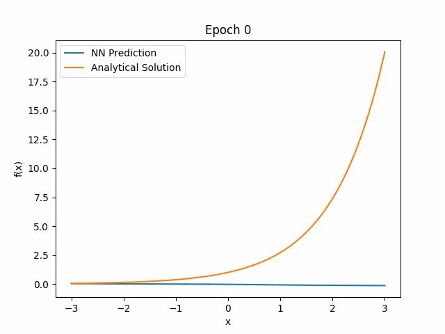

# Physics-Informed Neural Networks (PINNs)

## **Project Goal**

The goal of this project is to develop a framework using a deep learning model to approximate solutions to Partial Differential Equations (PDEs) without requiring any input data. The Physics-Informed Neural Network (PINN) is trained solely on:

- **Physics Loss**: Derived from the governing equations (e.g., PDE = 0).
- 
- **Boundary Conditions (BC) Loss**: Ensuring the solution satisfies the boundary constraints.

## **Objectives**

The project progresses through increasingly complex problems:

1. **Simple ODEs** :white_check_mark:: 
   - ODE: f' = f, f(0) = 1
   - Physics Loss: f' - f = 0
   - Boundary Loss: f(0) = 1
   - Analytical solution: exponential
   

2. **Higher-Order ODEs** :x::
   - ODE: f'' = f, f(0) = 1, f'(0) = 0
   - Physics Loss: f'' - f = 0
   - Boundary Loss: f(0) = 1, f'(0) = 0
   - Analytical solution: cosinus

3. **PDEs** :x::
   - Example: \( \nabla f = 0 \)

4. **Navier-Stokes Equations** :x::
   - Solve fluid dynamics problems governed by the Navier-Stokes equations.

### **Installation**

Ensure you have the following installed on your system:

- ✔️ Python 3.8+  
- ✔️ PyTorch (with MPS support for macOS or CUDA for NVIDIA GPUs)  
- ✔️ Additional Python dependencies (install via `requirements.txt`)

1. **Clone the Repository**:

   Clone this repository to your local machine:
   ```bash
   git clone https://github.com/LeonDeligny/LearnPDEs.git
   cd LearnPDEs

2. **Install dependencies**: 

   Install the dependencies with:
   ```bash
   pip install -r requirements.txt