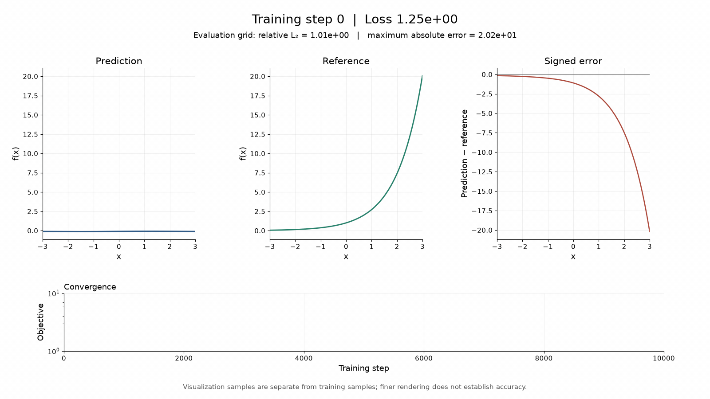
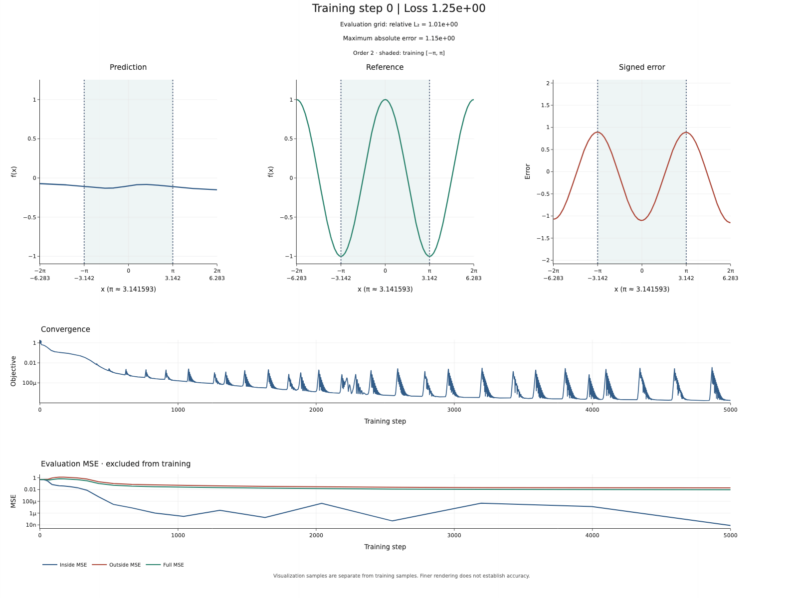
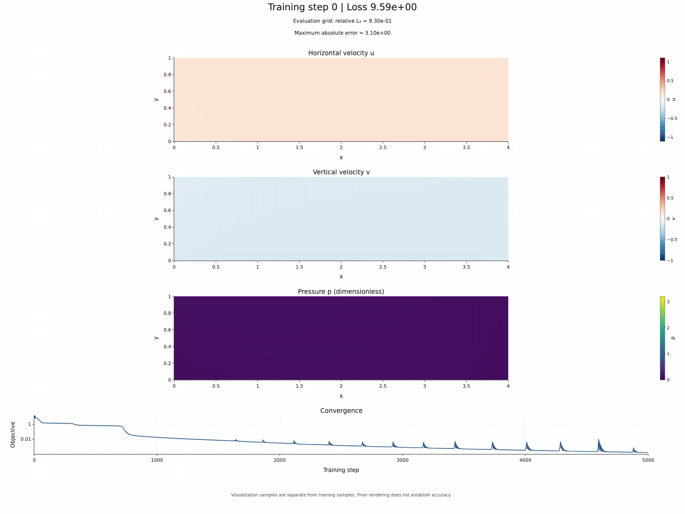
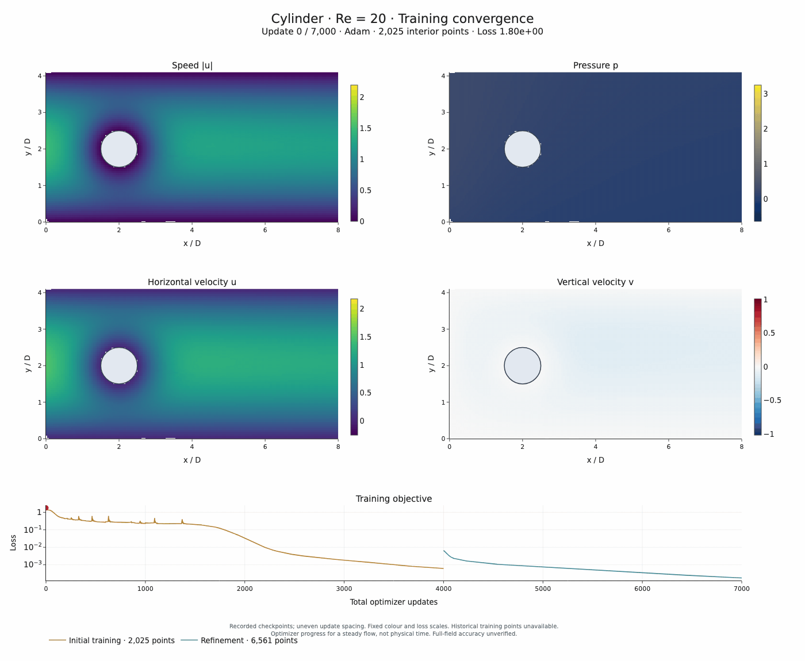

# LearnPDEs — Physics-Informed Neural Networks in PyTorch

[](https://app.codacy.com/gh/LeonDeligny/LearnPDEs/dashboard?utm_source=gh&utm_medium=referral&utm_content=&utm_campaign=Badge_grade)
[](https://github.com/LeonDeligny/LearnPDEs/blob/main/LICENSE)

## **Project Goal**

The goal is to approximate solutions to ordinary and partial differential
equations using physics-informed neural networks (PINNs). Training uses only:

- **Physics Loss**: Derived from the governing equations (e.g., PDE = 0).
- **Boundary Conditions (BC) Loss**: Ensuring the solution satisfies the boundary constraints.
- **Initial Conditions (IC) Loss**: Prescribing the initial state for ODEs and time-dependent PDEs.

> [!WARNING]
**Never use simulation data in any scenario, including for validation or
comparison.** No numerical ODE trajectories, CFD/FEM/FDM/spectral solution
fields, teacher-model predictions, simulation-derived boundary values, or
published simulation-derived scalar benchmarks are allowed. Geometry and
collocation coordinates are allowed; they are not solution labels.

Comparison values must come from analytical solutions or explicitly labelled
manufactured exact solutions. Exact interior values are evaluation-only and
must never enter training, pretraining, adaptive sampling, or early stopping.
Prescribed forcing and exact initial/boundary traces are legitimate problem
inputs. No experimental reference dataset is currently selected.

## Objectives and tutorials

Learn how to solve differential equations with physics-informed neural networks
in PyTorch. These worked examples explain the equations, automatic
differentiation, and loss functions, with runnable code and training animations.

Start with the [tutorial setup and running instructions](docs/tutorials/README.md).

The following scenarios are implemented; their accuracy must be established
using the [staged validation plan](docs/validation.md). Additional intermediate
ODEs and PDEs in that plan are proposed, not yet runnable. The first-order
[A1–A3 progression](docs/tutorials/README.md#first-order-ode-progression-a1a3)
is available as `exponential`, `forced-linear`, and `logistic`.
The [fluid scenario log](docs/fluid-scenario-log.md) records measured verification
results, cylinder plots, and the staged path toward airfoil flow.

1. **Simple ODEs: exponential growth** — implemented:

   Follow the [exponential growth tutorial](docs/tutorials/exponential-ode-pinn-pytorch.md)
   to solve a first-order ODE with automatic differentiation and an initial condition.

   - PINN: $f_{\theta}: \mathbb{R} \rightarrow \mathbb{R}$
   - ODE to approximate: $f' = f, f(0) = 1$
   - Physics Loss: $\lVert f_{\theta}' - f_{\theta}\rVert$
   - Boundary Loss: $\lVert f_{\theta}(0) - 1 \rVert$
   - Analytical solution: $\exp: \mathbb{R} \rightarrow \mathbb{R}$

   

1. **Higher-Order ODEs: harmonic oscillator** — implemented:

   Follow the [harmonic oscillator tutorial](docs/tutorials/harmonic-oscillator-pinn-pytorch.md)
   to solve a second-order ODE with initial value and derivative constraints.

   - PINN: $f_{\theta}: \mathbb{R} \rightarrow \mathbb{R}$
   - ODE to approximate: $f'' = -f, f(0) = 1, f'(0) = 0$
   - Physics Loss: $\lVert f_{\theta}'' + f_{\theta} \rVert$
   - Boundary Loss: $\lVert f_{\theta}(0) - 1 \rVert, \lVert f'_{\theta}(0) \rVert$
   - Analytical solution: $\cos: \mathbb{R} \rightarrow \mathbb{R}$

   

1. **Laplace Equation** — implemented:

   Follow the [Laplace equation tutorial](docs/tutorials/laplace-pinn-pytorch.md)
   to solve a two-dimensional boundary-value problem.

   - PINN: $f_{\theta}: [0, 1]^2 \rightarrow \mathbb{R}$
   - PDE to approximate: $\Delta f = 0$
   - Dirichlet boundary conditions: $f(\cdot, 0) = 0, f(\cdot, 1) = \sin(\pi x), f(0, \cdot) = 0, f(1, \cdot) = 0$
   - Physics loss: $\lVert \Delta f_{\theta} \rVert$
   - Boundary loss: $\lVert f_{\theta}(\cdot, 0) \rVert, \lVert f_{\theta}(\cdot, 1) - \sin(\pi x) \rVert, \lVert f_{\theta}(0, \cdot) \rVert, \lVert f_{\theta}(1, \cdot) \rVert$
   - Analytical solution: $f(x, y) = \sin(\pi x) \sinh(\pi y)/\sinh(\pi)$

   

1. **Potential, irrotational flow** — exploratory:
   - Wind tunnel scenario with no geometry
   - PINN: $\phi_{\theta}: [0, 4] \times [0, 1] \rightarrow \mathbb{R}$
   - PDE to approximate: $\Delta\phi=0$ (incompressibility).
   - Dirichlet boundary conditions: $(u, v)(\partial([0, 4] \times [0, 1])) = (1, 0)$
   - No simulation data. Compare velocity only with the analytical uniform
     field $(1,0)$; independent accuracy checks and a pressure-convention audit
     remain pending. Both bundled airfoil formulations are also exploratory;
     their meshes provide geometry, not admissible solution references.

   

1. **Navier–Stokes: Poiseuille flow between flat plates** — implemented:

   Follow the [Poiseuille flow tutorial](docs/tutorials/poiseuille-flow-pinn-pytorch.md)
   for the problem, training command, PyTorch loss, and accuracy checks.

   

   Use scenario **`poiseuille`** for steady, incompressible viscous flow in
   $[0,4]\times[0,1]$. The network predicts $(u,v,p)$ directly. In dimensionless
   model units, density is $\rho=1$, dynamic viscosity is $\mu=0.1$, and pressure
   drops from $3.2$ at the inlet to $0$ at the outlet. The residuals are

   $$
   u_x+v_y=0,\qquad
   \rho(u u_x+v u_y)+p_x-\mu(u_{xx}+u_{yy})=0,\qquad
   \rho(u v_x+v v_y)+p_y-\mu(v_{xx}+v_{yy})=0.
   $$

   Both plates ($y=0$ and $y=1$) enforce **no slip and no penetration**, $u=v=0$.
   At the inlet and outlet, $u_x=0$ and $v=0$ specify fully developed flow;
   the prescribed pressures supply the forcing and fix the pressure reference.
   There is no body force and no prescribed parabolic velocity target in training.

   For $G=-dp/dx=\Delta p/L$, the exact solution is

   $$
   u(y)=\frac{G}{2\mu}y(H-y)=4y(1-y),\qquad
   v=0,\qquad p(x)=0.8(4-x).
   $$

   It has centerline speed $u(1/2)=1$ and mean speed $2/3$. This pressure–viscosity
   balance and parabolic profile follow the
   [MFiX plane Poiseuille verification case](https://mfix.netl.doe.gov/doc/vvuq-manual/main/html/fluid/fld-01.html),
   with the model constants and fully developed end conditions specified above.

   Train on a 21 × 21 collocation grid and evaluate against the exact solution on
   a separate 41 × 41 grid:

   ```bash
   uv run --group export learnpdes train poiseuille --epochs 5000 --points 21
   ```

   The runner saves GIF and HTML under `assets/runs/poiseuille/<run-id>/`, prints their
   paths, and reports aggregate errors and individual velocity/pressure errors.
   Use `--output-dir` to choose another directory and `--max-frames` to control the
   number of checkpoints (40 by default). PNGs remain in the run’s `frames/` directory.
   For $v$, whose exact value is zero everywhere, it reports absolute errors only.
   Use `--epochs 10` for a quick execution check. The optimized objective is
   `3 * physics_loss + boundary_loss`; the exact solution is used only for evaluation.

   To export an interactive figure with prediction, reference, signed-error views,
   and training loss:

   ```python
   from learnpdes.config import RunConfig
   from learnpdes.training import train

   trainer = train(RunConfig('poiseuille', epochs=5000, output_dir='assets'))
   print(trainer.html_path)  # assets/runs/poiseuille/<run-id>/training.html
   ```

   The CLI and Python entry point both default to 21 × 21 training points and an
   independent 51 × 51 display grid. Parameters and the reference solution are in
   [learnpdes/scenarios/poiseuille.py](learnpdes/scenarios/poiseuille.py); the
   [benchmark tests](tests/scenarios/test_poiseuille.py) verify the exact solution, pressure
   forcing, no-slip walls, automatic derivatives, and training/plot integration.

1. **Navier–Stokes: Kovasznay flow on a rectangle** — implemented:

   Use scenario **`kovasznay`** for coupled nonlinear, steady, incompressible 2D
   Navier–Stokes on $[-0.5,1]\times[-0.5,1.5]$, with **no obstacle**. The network
   predicts $(u,v,p)$ directly. The dimensionless setup uses $Re=40$, unit density,
   kinematic viscosity $\nu=1/Re=0.025$, and zero body force:

   $$
   u u_x+v u_y+p_x-\nu(u_{xx}+u_{yy})=0,
   \qquad
   u v_x+v v_y+p_y-\nu(v_{xx}+v_{yy})=0,
   \qquad
   u_x+v_y=0.
   $$

   The exact solution is

   $$
   \lambda=\frac{Re}{2}-\sqrt{\frac{Re^2}{4}+4\pi^2},\qquad
   u=1-e^{\lambda x}\cos(2\pi y),\qquad
   v=\frac{\lambda}{2\pi}e^{\lambda x}\sin(2\pi y),\qquad
   p=\frac{1-e^{2\lambda x}}{2}.
   $$

   Both velocity components take their exact values on all four rectangle edges;
   these edges are not stationary no-slip walls. The exact pressure at the
   bottom-right corner $(1,-0.5)$ fixes the additive pressure constant. The loss
   sums the three mean squared PDE residuals and ten times each boundary and
   pressure penalty. Interior exact values are reserved for evaluation.

   Train with 961 independent interior samples and 124 samples per edge. Adam
   resamples every 100 steps; L-BFGS holds its samples fixed. The 4 × 64 tanh MLP
   reports aggregate and per-component errors on 2,048 unseen uniform points:

   ```bash
   uv run learnpdes train kovasznay --epochs 1500 --lbfgs-steps 1500 --points 31
   ```

   The command saves GIF, HTML, metadata, and weights under
   `assets/runs/kovasznay/<run-id>/`. PNG checkpoints remain in its `frames/` folder. Use `--max-frames 40` and
   `--resolution 51` to control checkpoint count and display resolution, or
   `--no-gif` for HTML only. For a quick setup check, use `--epochs 10`; this
   verifies execution, not convergence. The Python entry point also saves a GIF
   and an interactive figure with velocity, pressure, reference fields, signed
   errors, and training loss:

   ```python
   from learnpdes.config import RunConfig
   from learnpdes.training import train

   trainer = train(RunConfig('kovasznay', epochs=1000, output_dir='assets'))
   print(trainer.html_path)  # assets/runs/kovasznay/<run-id>/training.html; GIF beside it
   ```

   The CLI and Python entry point both default to 961 interior samples, 124
   samples per boundary, and an independent 51 × 51 display grid. Benchmark constants and the NumPy/Torch
   exact solution live in [learnpdes/scenarios/kovasznay.py](learnpdes/scenarios/kovasznay.py).
   The [benchmark tests](tests/scenarios/test_kovasznay.py) check exact residual cancellation,
   both momentum equations, all velocity boundaries, the pressure gauge, and
   training/evaluation integration. The equations and rectangle follow the
   [DeepXDE Kovasznay implementation](https://deepxde.readthedocs.io/en/latest/demos/pinn_forward/Kovasznay.flow.html#implementation),
   using $Re=40$ and a single pressure reference point here. The analytical
   solution originates in [Kovasznay (1948)](https://doi.org/10.1017/S0305004100023999).
   No simulation data are used; compare with the exact formula only.

1. **Navier–Stokes: circular Couette flow** — implemented:

   Follow the [circular Couette tutorial](docs/tutorials/circular-couette-pinn-pytorch.md)
   to verify curved no-slip walls against an exact annular-flow solution.
   Scenario **`circular-couette`** predicts $(u,v,p)$ between a stationary inner
   wall at $r=1$ and a rotating outer wall at $r=2$, with tangential speed 1.
   The analytical interior solution is used only for evaluation.

   ```bash
   uv run learnpdes train circular-couette --epochs 1500 --lbfgs-steps 2000 --points 32 --no-gif
   ```

1. **Navier–Stokes: low-Reynolds-number flow around a cylinder** — exploratory

   Scenario **`cylinder`** implements the steady DFG 2D-1 channel benchmark at
   $Re=20$. It uses direct $(u,v,p)$ outputs, a 4 × 64 tanh MLP, exact inlet and
   no-slip wall enforcement, and a do-nothing outlet that fixes pressure.

   ```bash
   uv run learnpdes train cylinder --epochs 1500 --lbfgs-steps 2500 --points 45 --no-gif
   uv run learnpdes refine path/to/cylinder-run --points 81 --lbfgs-steps 3000
   uv run learnpdes plot path/to/refined-run --png
   ```

   [Cylinder setup and validation](docs/tutorials/cylinder-flow-pinn-pytorch.md)
   explains nondimensionalization, geometry, boundary conditions, reference
   quantities, and quantitative training tests. Fluid runs also save each PDE
   and boundary loss in `residuals.csv`. The evaluator reports predicted drag,
   lift, pressure drop, and mass balance as diagnostics. Published DFG reference
   values come from numerical simulations and are excluded from comparison.
   No simulation data are allowed, even for validation. With no selected exact
   reference for this setup, cylinder solution accuracy remains unverified.

   **Recorded result — Re=20, seed 0.** The refined checkpoint passes its
   single-run physics checks. After 1,500 Adam and 2,500 L-BFGS updates on 2,025
   interior points, it received 3,000 L-BFGS updates on 6,561 fixed points.
   The table reports the worst value across two independent evaluation sets
   of 4,096 and 8,192 interior points, with 256 samples per boundary.

   | Diagnostic | Measured value |
   | --- | ---: |
   | Continuity RMS | 0.00639 |
   | Horizontal momentum RMS | 0.00896 |
   | Vertical momentum RMS | 0.00595 |
   | Outlet flux error against prescribed inlet flux | 0.00232% |

   

   The GIF replays 47 saved prediction checkpoints from the initial model through
   the final refinement, with fixed colour scales. This is optimizer progress
   for a steady flow, not physical-time evolution. The loss changes when
   refinement switches to a new, denser collocation set.

   [Interactive fields](assets/examples/cylinder/plots/flow-fields.html) ·
   [Equation residuals](assets/examples/cylinder/plots/equation-residuals.html) ·
   [Full channel](assets/examples/cylinder/plots/full-channel.html) ·
   [Verification report](assets/verification/cylinder/20260927T131815.547280Z-deeed8d6.json)

   Regenerate the animation from the saved run and its parent:

   ```bash
   uv run learnpdes plot path/to/refined-run --training-gif
   ```

   **Full-field accuracy and repeatability remain unverified.** A separate run
   from scratch missed the 0.01 momentum-RMS threshold; both results are in the
   [fluid scenario log](docs/fluid-scenario-log.md). These reported checks use
   equations, boundary conditions, and prescribed flux only. This historical
   checkpoint predates collocation recording, so its training points cannot
   be overlaid.

### **Installation**

Ensure you have the following installed on your system:

- ✔️ Python 3.12
- ✔️ CPU, or MPS support for acceleration on macOS
- ✔️ [uv](https://docs.astral.sh/uv/)
- ✔️ Additional Python dependencies

1. **Clone the Repository**:

   Clone this repository to your local machine:
   ```bash
   git clone https://github.com/LeonDeligny/LearnPDEs.git
   cd LearnPDEs
   ```

2. **Install uv**:

   Follow the [uv installation instructions](https://docs.astral.sh/uv/getting-started/installation/).

3. **Install dependencies**:

   Install the dependencies with:
   ```bash
   uv sync
   ```

   This creates a `.venv` virtual environment and installs the dependencies from `uv.lock`.

4. **Run the tests**:

   `tests/scenarios/` checks scenario physics. `tests/workflows/` runs training,
   export, and saved-run workflows.

   ```bash
   uv run python -m unittest discover -s tests -p "test*.py"
   ```

5. **Check code quality**:

   Install the documentation dependencies so the type checker can also inspect
   the website hooks, then run the same checks as CI:

   ```bash
   uv sync --locked --group docs
   uv run ruff check .
   uv run ruff format --check .
   uv run --group docs pyright
   uv run lizard -l python -C 12 -L 100 -a 14 -w learnpdes docs/website tests
   ```

   Ruff requires function annotations and limits branching. Pyright checks the
   package, tests, and website code against the project virtual environment.
   Lizard checks complexity and function length using Codacy's analyzer. The
   local check allows up to 14 parameters to retain the public training and
   plotting APIs and named CLI options. Codacy still applies its own parameter
   limits.

   Generated example figures and their bundled Plotly runtime are excluded from
   Codacy; their source code, templates, website assets, and tests remain checked.
