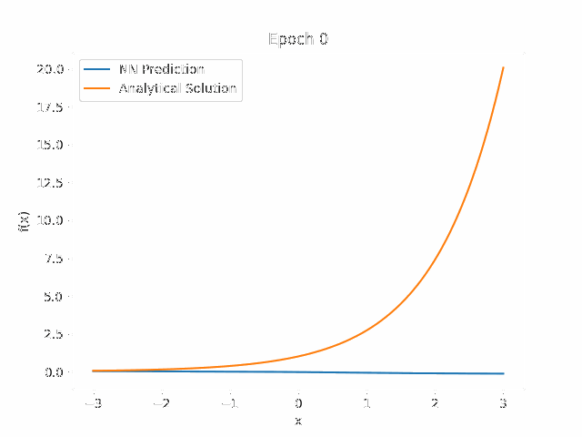
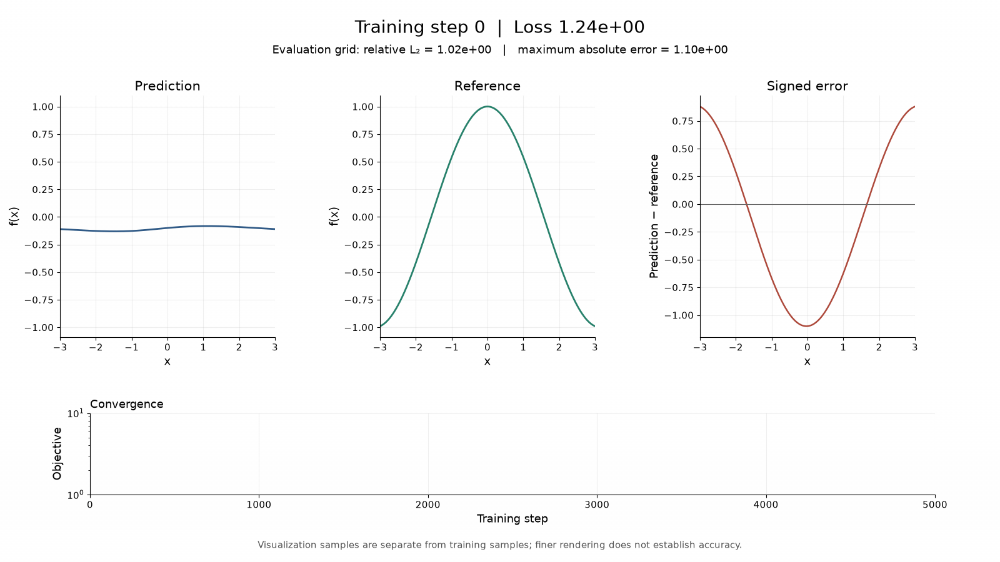
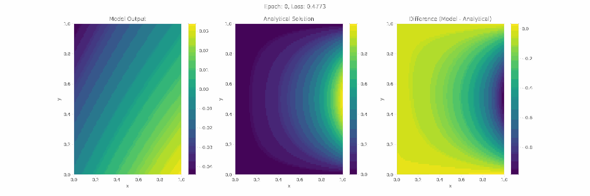
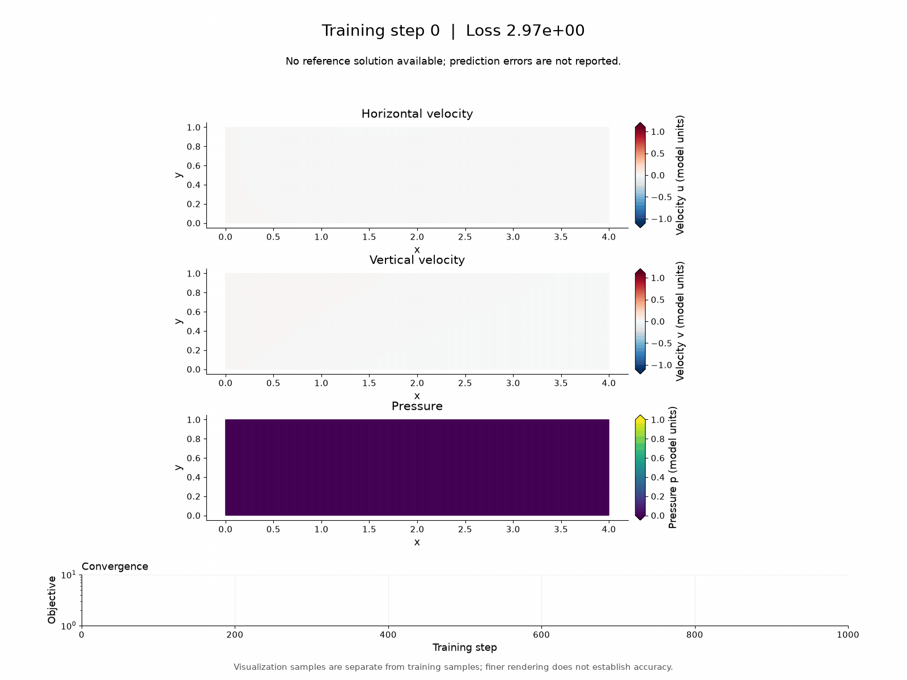

# LearnPDEs — Physics-Informed Neural Networks in PyTorch

[](https://app.codacy.com/gh/LeonDeligny/LearnPDEs/dashboard?utm_source=gh&utm_medium=referral&utm_content=&utm_campaign=Badge_grade)
[](https://github.com/LeonDeligny/LearnPDEs/blob/main/LICENSE)

## **Project Goal**

The goal of this project is to develop a framework using a deep learning model to approximate solutions to Partial Differential Equations (PDEs) without requiring any input data. The Physics-Informed Neural Network (PINN) is trained solely on:

- **Physics Loss**: Derived from the governing equations (e.g., PDE = 0).
- **Boundary Conditions (BC) Loss**: Ensuring the solution satisfies the boundary constraints.

## Tutorials

Learn how to solve differential equations with physics-informed neural networks
in PyTorch. These worked examples explain the equations, automatic
differentiation, and loss functions, with runnable code and training animations.

- [Physics-informed neural networks for ODEs: a worked example](docs/tutorials/ode-pinn-pytorch.md): exponential growth and cosine oscillations.
- [Solve the Laplace equation with a PINN in PyTorch](docs/tutorials/laplace-pinn-pytorch.md): a two-dimensional boundary-value problem.
- [Implementing PINN boundary-condition losses in PyTorch](docs/tutorials/pinn-boundary-condition-losses-pytorch.md): value constraints, derivative constraints, and loss weighting.

Start with the [tutorial setup and running instructions](docs/tutorials/README.md).

The tutorials also have a static documentation site prepared for GitHub Pages.
To preview it locally without installing the training dependencies:

```bash
UV_PROJECT_ENVIRONMENT=.venv-docs uv run --locked --only-group docs mkdocs serve
```

Open <http://127.0.0.1:8000/LearnPDEs/>. See the
[website launch guide](maintenance/website-launch.md) for validation, the manual
publishing workflow, Search Console setup, and sharing drafts. The website is
not deployed yet; pushes and pull requests only build and check it.

Training plots evaluate a separate visualization grid (300 × 300 for Laplace,
300 points for ODEs); `main(..., visualization_resolution=300)` controls it
without changing the collocation points. Laplace fields use
[`pcolormesh`](https://matplotlib.org/stable/api/_as_gen/matplotlib.pyplot.pcolormesh.html).
Airfoil plots evaluate a refined copy of the SU2 fluid mesh, preserving its
boundary edges, solid interior, and concentration of points near the surface.
More visualization samples reveal the learned solution; they do not improve
the trained model or replace independent numerical validation.

Frames are 1600 × 900 pixels with fixed panel and colorbar positions. Scalar
problems show prediction, analytical reference, signed error, and objective
convergence. Titles report scientific-notation loss, discrete relative L₂ error,
and maximum absolute error on the visualization samples. Flow plots label all
three fields and omit error metrics when no reference is available. The tutorial
runner also reports relative L₂ error on its separate validation grid.

Animations loop at 10 FPS (100 ms per checkpoint), holding the final result for
2 seconds. Checkpoints follow a logarithmic schedule with at most 80 frames,
including the untrained model at step 0 and the final completed optimizer step.
The `Trainer` plot options `max_frames`, `duration_ms`, `final_hold_ms`,
`output_dir`, and `gif_path` customize capture and playback. Durations use
[Pillow's millisecond convention](https://pillow.readthedocs.io/en/stable/handbook/image-file-formats.html#gif)
and must be positive multiples of 10 ms, the GIF format's timing precision.

## **Objectives**

The project progresses through increasingly complex problems:

1. **Simple ODEs** :white_check_mark:: 
   - PINN: $f_{\theta}: \mathbb{R} \rightarrow \mathbb{R}$
   - ODE to approximate: $f' = f, f(0) = 1$
   - Physics Loss: $\lVert f_{\theta}' - f_{\theta}\rVert$
   - Boundary Loss: $\lVert f_{\theta}(0) - 1 \rVert$
   - Analytical solution: $\exp: \mathbb{R} \rightarrow \mathbb{R}$
  

1. **Higher-Order ODEs** :white_check_mark::
   - PINN: $f_{\theta}: \mathbb{R} \rightarrow \mathbb{R}$
   - ODE to approximate: $f'' = -f, f(0) = 1, f'(0) = 0$
   - Physics Loss: $\lVert f_{\theta}'' + f_{\theta} \rVert$
   - Boundary Loss: $\lVert f_{\theta}(0) - 1 \rVert, \lVert f'_{\theta}(0) \rVert$
   - Analytical solution: $\cos: \mathbb{R} \rightarrow \mathbb{R}$
  

1. **Laplace Equation** :white_check_mark::
   - PINN: $f_{\theta}: [0, 1]^2 \rightarrow \mathbb{R}$
   - PDE to approximate: $\Delta f = 0$
   - Dirichlet boundary conditions: $f(\cdot, 0) = 0, f(\cdot, 1) = \sin(\pi x), f(0, \cdot) = 0, f(1, \cdot) = 0$
   - Physics loss: $\lVert \Delta f_{\theta} \rVert$
   - Boundary loss: $\lVert f_{\theta}(\cdot, 0) \rVert, \lVert f_{\theta}(\cdot, 1) - \sin(\pi x) \rVert, \lVert f_{\theta}(0, \cdot) \rVert, \lVert f_{\theta}(1, \cdot) \rVert$
   - Analytical solution: $f(x, y) = \sin(\pi x) \sinh(\pi y)/\sinh(\pi)$
  

1. **Euler Equations (potential, irrotational flow)** :white_check_mark::
   - Wind tunnel scenario with no geometry
   - PINN: $\phi_{\theta}: [0, 4] \times [0, 1] \rightarrow \mathbb{R}$
   - PDE to approximate: None
   - Dirichlet boundary conditions: $(u, v)(\partial([0, 4] \times [0, 1])) = (1, 0)$
   

2. **Navier-Stokes Equations** :x::
   - Solve fluid dynamics problems governed by the Navier-Stokes equations.

### **Installation**

Ensure you have the following installed on your system:

- ✔️ Python 3.12
- ✔️ CPU, or MPS support for acceleration on macOS
- ✔️ [uv](https://docs.astral.sh/uv/)
- ✔️ Additional Python dependencies

1. **Clone the Repository**:

   Clone this repository to your local machine:
   ```bash
   git clone https://github.com/LeonDeligny/LearnPDEs.git
   cd LearnPDEs
   ```

2. **Install uv**:

   Follow the [uv installation instructions](https://docs.astral.sh/uv/getting-started/installation/).

3. **Install dependencies**:

   Install the dependencies with:
   ```bash
   uv sync
   ```

   This creates a `.venv` virtual environment and installs the dependencies from `uv.lock`.

4. **Run the tests**:

   ```bash
   uv run python -m unittest discover -s tests -p "test*.py"
   ```
