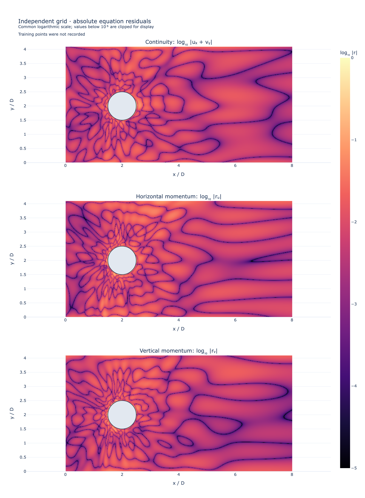

# Fluid scenario test log

Updated 2026-09-27. Each row is a separate scenario with its own training
directory, configuration, checkpoint, residual history, and verification report.
Training uses equations and boundary data only. No numerical simulation
reference is used in the reports linked here. These are single-seed results;
none establishes the full [project acceptance gate](validation.md).

| Stage | Scenario | What is checked | Recorded result |
| --- | --- | --- | --- |
| 1 | `kovasznay` | Coupled convection and pressure against an exact interior solution | Passed single-run checks; worst u/v/p relative L2 over two evaluation sets: 0.0663% / 0.4248% / 0.5223%. |
| 2 | `circular-couette` | Curved no-slip walls and radial pressure balance against an exact solution | Passed single-run checks; worst u/v/p relative L2: 0.0409% / 0.0443% / 0.6311%. |
| 3 | `cylinder` | Stationary obstacle and wake; no admissible exact full-setup reference | Passed physics diagnostics: worst continuity/x-momentum/y-momentum RMS 0.00639 / 0.00896 / 0.00595; flux error 0.00232%. Full-field accuracy remains unverified. |
| 4, pending | Joukowski airfoil potential flow | First airfoil step with an exact analytical reference; inviscid slip-wall physics | Not implemented or promoted in this delivery; finish prerequisite acceptance checks first. |
| Later, pending | Viscous airfoil | No-slip airfoil boundary layers with direct `(u,v,p)` | Requires a separately specified admissible validation setup. Existing bundled potential/streamfunction cases remain exploratory. |

The Kovasznay run uses 1,500 Adam and 1,500 L-BFGS updates on 961 interior
points. Circular Couette uses 1,500 Adam and 2,000 L-BFGS updates on 1,024
interior points. Cylinder uses 1,500 Adam and 2,500 L-BFGS updates on 2,025
points, followed by 3,000 L-BFGS updates on a new, fixed set of 6,561 points.
All use seed 0 and four 64-unit tanh layers. Refinement uses only physics loss.

Each reported checkpoint was reevaluated on 4,096 interior points with seed
2027 and 8,192 with seed 1729, plus 256 points per boundary. Full provenance,
all metrics, fixed thresholds, and pass/fail checks are in these separate records:

- [Kovasznay report](../assets/verification/kovasznay/20260927T124950.024802Z-cb8877fb.json)
- [Circular Couette report](../assets/verification/circular-couette/20260927T134119.749576Z-013c30d9.json)
- [Cylinder report](../assets/verification/cylinder/20260927T131815.547280Z-deeed8d6.json)
- [Cylinder from-scratch density check](../assets/verification/cylinder/20260927T131816.937651Z-71199bef.json): 4,096 collocation points,
  1,500 Adam + 5,000 L-BFGS. This run **fails** the 0.01 momentum-RMS threshold
  (worst horizontal/vertical values 0.01106 / 0.01050). It is retained alongside
  the successful refinement; repeatability and density independence are not
  established. This is another reason not to advance to the harder airfoil yet.

Cylinder plots evaluate the network directly on fresh coordinates and mask
the solid before evaluation. Colour plots alone are not evidence of accuracy.


The animation replays 47 recorded checkpoints across 4,000 initial training
updates and 3,000 refinement updates. Colour scales stay fixed. These are
optimizer steps for a steady problem, not physical-time frames. The loss is
re-evaluated on a new, denser point set at the refinement boundary.



[Interactive fields](../assets/examples/cylinder/plots/flow-fields.html) ·
[Interactive residuals](../assets/examples/cylinder/plots/equation-residuals.html) ·
[Full channel](../assets/examples/cylinder/plots/full-channel.html) ·
[Residual history](../assets/examples/cylinder/plots/convergence.html) ·
[Animation provenance](../assets/examples/cylinder/plots/training-animation.json)

These plots use the same saved checkpoint as the cylinder verification report.
The historical run did not record its collocation coordinates; its plots report
that they are unavailable. The recent short runs used to check point overlays
are not used as cylinder convergence results.

Recreate the reports independently of training:

```bash
uv run learnpdes verify path/to/kovasznay-run path/to/couette-run path/to/cylinder-run
```

Recreate plots from a completed cylinder run:

```bash
uv run learnpdes plot path/to/cylinder-run --resolution 601 --png
uv run learnpdes plot path/to/refined-cylinder-run --training-gif
```

The plotting command writes interactive HTML and, with `--png`, standalone
images. PNG export requires the installed Chrome/Kaleido renderer. The new
reports intentionally exclude numerical-reference comparisons in historical
cylinder run manifests; those comparisons do not meet the current policy.
