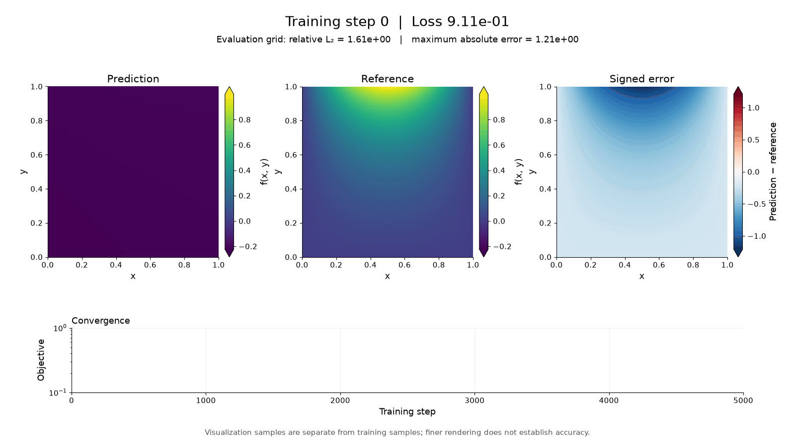

# Laplace equation

**No simulation data:** train only on the PDE and prescribed boundary
conditions; compare only with the analytical solution below. Exact interior
values never enter training. The center value is $0.199268407669$.
Existing training and evaluation grids overlap; the
[staged validation gate](../validation.md) requires disjoint samples and three seeds.

## Problem

Find $u$ on the unit square $[0,1]^2$:

$$
u_{xx}+u_{yy}=0.
$$

Prescribe the four edges:

$$
\begin{aligned}
u(x,0)&=0,& u(x,1)&=\sin(\pi x),\\
u(0,y)&=0,& u(1,y)&=0.
\end{aligned}
$$

Exact solution:

$$
u(x,y)=\frac{\sin(\pi x)\sinh(\pi y)}{\sinh(\pi)}.
$$

## Run

After [setup](README.md#install), run:

```bash
uv run learnpdes train laplace --epochs 5000 --points 21
```

This samples a $21\times21$ grid, including the edges. The network maps
$(x,y)$ to $u$; exact interior values are used only for evaluation.



Recorded run; not regenerated by this command.

## Loss

Minimize the squared Laplacian plus a mean squared error for each edge:

$$
\mathcal L=3\,\operatorname{mean}\big[(u_{\theta,xx}+u_{\theta,yy})^2\big]
+\sum_{\text{edges}}\operatorname{MSE}(u_\theta,u_{\text{boundary}}).
$$

Save as `inspect_loss.py` in the repo root; run `uv run python inspect_loss.py`.

```python
import torch
from learnpdes.training import build_problem

torch.manual_seed(0)
model, problem, _ = build_problem('laplace', points=21)
u = model(problem.inputs)
dx = problem.partial_derivative(u, problem.x)
dy = problem.partial_derivative(u, problem.y)
dxx = problem.partial_derivative(dx, problem.x)
dyy = problem.partial_derivative(dy, problem.y)
physics = (dxx + dyy).square().mean()

top = torch.sin(torch.pi * problem.x[problem.top_mask])
edges = {
    'bottom': u[problem.bottom_mask].square().mean(),
    'top': (u[problem.top_mask] - top).square().mean(),
    'left': u[problem.inlet_mask].square().mean(),
    'right': u[problem.outlet_mask].square().mean(),
}
loss = 3 * physics + sum(edges.values())

reference, *_ = problem.laplace_loss()
torch.testing.assert_close(loss, reference)
print({edge: value.item() for edge, value in edges.items()})
```

Keep gradients enabled and edge targets shaped `(M, 1)` to avoid broadcasting.
`inlet` and `outlet` mean left and right edges here.
[Loss source](../../learnpdes/scenarios/laplace.py).

## Check

The runner reports RMSE, maximum error and relative L2 error on a separate
$41\times41$ grid. A zero prediction satisfies the PDE but fails the top edge:
inspect both physics and boundary errors. Increasing `--points` improves
sampling but costs quadratically; convergence is not guaranteed.

[Training source](../../learnpdes/training.py)
